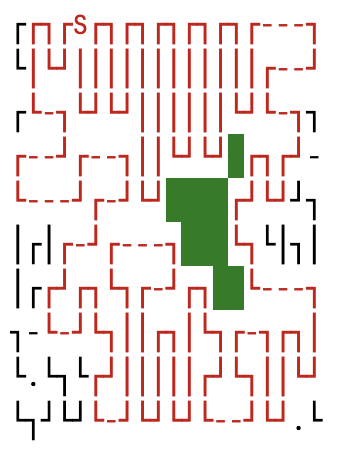

Advent of Code 2023
=
  
Solutions for [aoc 2023](https://adventofcode.com/2023)

All code is in Kotlin 1.9

Featured solutions:
===
* [Day 10](src/main/kotlin/Day10.kt) - unreadable due to code golf but kinda cool. It also produces nice visual: 
* [Day12](src/main/kotlin/Day12.kt) - that one was really hard for me, I struggled a lot. 
Memoizing function by wrapping its body with `cache.getOrPut(key) { ... }` was fun.
* [Day15](src/main/kotlin/Day15.kt) - super straightforward due to LinkedHashMap being part of std, 
I feel sorry for langs that don't have it
* [Day17](src/main/kotlin/Day17.kt) - nice viz as well 
* [Day18](src/main/kotlin/Day18.kt) - I was able to find bug due to visualization: 
* [Day20](src/main/kotlin/Day20.kt) - For part 2 I just eye-balled the data, came up with a hacky idea 
and did several runs to calculate different periods. No clue how to solve it in general case

Part 2 of days 21, 23 and 24 is beyond my comprehension. I have 0 clue how to solve it.  

